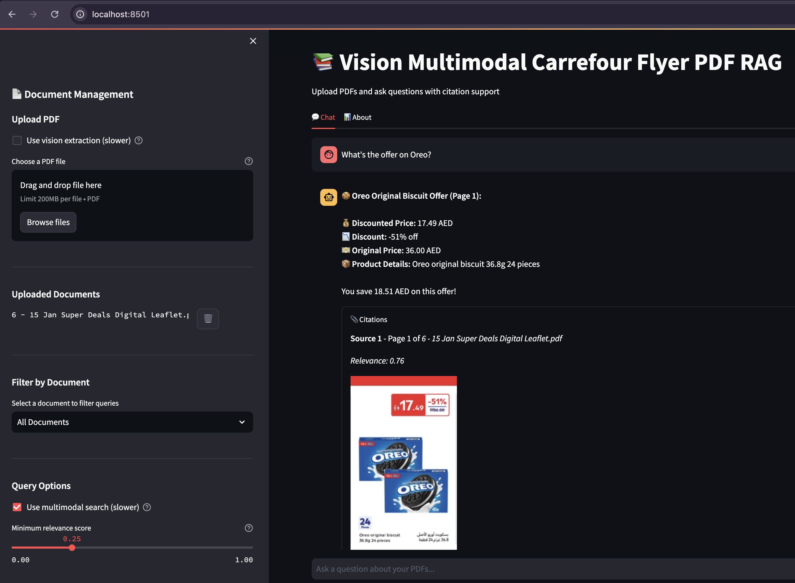
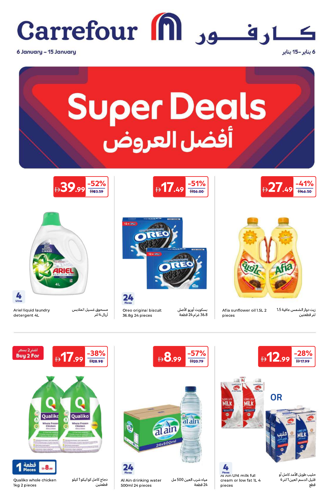

# Vision Multimodal Carrefour Flyer PDF RAG System

A Retrieval-Augmented Generation (RAG) system that allows you to upload PDF documents, ask questions, and get answers with visual citations showing the exact PDF pages where information is found.

## ✅ Example Output (Oreo)

**Query:** "What is the offer on Oreo?"

**Visual citation crop (from the sample Carrefour flyer):**





## 🎯 Features

- **PDF Upload**: Upload and process PDF documents
- **Question Answering**: Ask questions about your uploaded PDFs
- **Semantic Search**: Find relevant information using vector embeddings
- **Multimodal RAG**: Optional hybrid search over text + image embeddings
- **Vision Extraction**: Optional VLM-based product extraction with bounding boxes
- **Cropped Citations**: Product-level crops in addition to full-page images
- **Citations**: See page numbers and text snippets for each answer
- **Visual Citations**: View images of PDF pages where answers are located
- **Document Management**: Upload, list, and delete documents
- **Document Filtering**: Filter queries to specific PDFs

## 🏗️ Architecture

```
User (Streamlit UI)
  ↓
FastAPI Backend
  ↓
PDF Processor
  ├─ Extract text (pdfplumber) → Text chunks
  ├─ Render pages (pdf2image) → Page images
  └─ Optional VLM extraction (Granite/LLaVA) → Product boxes
  ↓
Vector Store (ChromaDB)
  ├─ Text embeddings (sentence-transformers)
  └─ Optional image embeddings (CLIP) for hybrid search
  ↓
RAG Service
  ├─ Text search (or hybrid search)
  ├─ Answer generation (LLM)
  └─ Visual citations (page + product crop)
  ↓
Response with citations and images
```

## 🔬 How It Works (Low-Level)

### 1. PDF Upload & Processing Pipeline

#### Step 1: PDF Text Extraction
When a PDF is uploaded via `/api/upload`:

1. **File Storage**: PDF is saved to `uploads/` directory
2. **Text Extraction** (using `pdfplumber`):
   ```python
   # For each page in the PDF:
   - Open PDF with pdfplumber.open(pdf_path)
   - Iterate through each page (enumerate from 1)
   - Extract text using page.extract_text()
   - Create chunk object with:
     * page_number: Page index (1-based)
     * text: Extracted text content
     * total_pages: Total page count
     * pdf_path: Absolute path to PDF file
   ```

3. **Page-Level Chunking**: Each page becomes a separate chunk, preserving page boundaries for accurate citation

#### Step 2: Page Image Generation
For visual citations, each page is converted to an image:

1. **Image Generation** (using `pdf2image` + `poppler`):
   ```python
   # For each page:
   - Generate unique filename: {pdf_hash}_page_{page_number}.png
   - Hash calculation: MD5(pdf_path)[:8] for uniqueness
   - Convert PDF page to PNG using convert_from_path()
     * DPI: 200 (configurable)
     * Format: PNG
   - Save to static/citations/ directory
   - Cache: If image exists, reuse it (no regeneration)
   ```

2. **Image Lookup Strategy**:
   - Primary: Exact hash match
   - Fallback: Pattern matching `*_page_{N}.png` if hash differs
   - This handles cases where PDF path changes but images exist

#### Step 2b: Optional VLM Product Extraction (Vision Models)
If enabled, each page image is sent to a vision-language model (VLM) to extract structured product data:

- **Models**: Granite 3.2 Vision or LLaVA via Ollama
- **Output**: Product name, price, discount, and bounding boxes
- **Use**: More precise product crops and multimodal search

#### Step 3: Vector Embedding Creation
Text chunks are converted to numerical vectors:

1. **Embedding Model**: `sentence-transformers/all-MiniLM-L6-v2`
   - Input: Text string (page content)
   - Output: 384-dimensional vector (float array)
   - Process: Transformer-based encoding

2. **Batch Encoding**:
   ```python
   texts = [chunk["text"] for chunk in chunks]
   embeddings = embedding_model.encode(texts).tolist()
   # Result: List of 384-dim vectors
   ```

3. **Optional Image Embeddings (CLIP)**:
   - When multimodal search is enabled, product crops are embedded using CLIP
   - These image vectors are stored in a separate ChromaDB collection

#### Step 4: Vector Store Indexing
Embeddings are stored in ChromaDB with metadata:

1. **ChromaDB Collection Structure**:
   ```python
   Collection: "pdf_documents"
   - embeddings: List[List[float]]  # Vector representations
   - documents: List[str]            # Original text chunks
   - metadatas: List[Dict]           # Page info, PDF name, path
   - ids: List[str]                  # Unique identifiers
   ```

2. **Metadata Schema**:
   ```python
   {
     "page_number": int,      # Page where text was found
     "pdf_name": str,         # Original filename
     "pdf_path": str,         # Absolute file path
     "total_pages": int       # Total pages in PDF
   }
   ```

3. **ID Format**: `{pdf_name}_page_{page_number}_chunk_{index}`

### 2. Query Processing Pipeline

#### Step 1: Query Embedding
When a question is asked:

1. **Question Vectorization**:
   ```python
   query_embedding = embedding_model.encode([question])[0]
   # Same 384-dim vector space as document chunks
   ```

#### Step 2: Semantic Search
Find most relevant chunks using cosine similarity:

1. **Vector Similarity Search** (ChromaDB):
   ```python
   # ChromaDB uses HNSW (Hierarchical Navigable Small World) index
   # for fast approximate nearest neighbor search
   
   results = collection.query(
     query_embeddings=[query_embedding],
     n_results=top_k,
     where=filter_dict  # Optional: filter by pdf_name
   )
   ```

2. **Optional Hybrid Search**:
   - Combines text similarity with CLIP image similarity
   - Improves product-specific queries when VLM extraction is enabled

2. **Similarity Metric**: Cosine similarity
   - Range: 0.0 (dissimilar) to 1.0 (identical)
   - Distance = 1 - similarity
   - Lower distance = Higher relevance

3. **Result Format**:
   ```python
   {
     "text": str,              # Original chunk text
     "metadata": Dict,         # Page info
     "distance": float         # Similarity distance (0-1)
   }
   ```

#### Step 3: Result Prioritization
Smart re-ranking for better results:

1. **Product-Specific Prioritization**:
   ```python
   # Example: For "Oreo" queries
   if "oreo" in question.lower():
     # Extract page 1 results (likely contains main product info)
     page_1_results = [r for r in results if r.metadata.page_number == 1]
     other_results = [r for r in results if r.metadata.page_number != 1]
     # Reorder: page 1 first, then others
     search_results = page_1_results + other_results
   ```

2. **Relevance Score Calculation**:
   ```python
   relevance_score = 1 - distance
   # Higher score = More relevant
   ```

#### Step 4: Citation Image Retrieval
For each retrieved chunk, get the corresponding page image:

1. **Image Path Resolution**:
   ```python
   pdf_path = metadata.get("pdf_path")  # From vector store
   page_num = metadata.get("page_number")
   
   # Generate or find image
   image_path = pdf_processor.generate_page_image(pdf_path, page_num)
   # Returns: /path/to/static/citations/{hash}_page_{N}.png
   ```

2. **URL Construction**:
   ```python
   filename = os.path.basename(image_path)
   image_url = f"/static/{filename}"
   # Served via FastAPI StaticFiles mount
   ```

#### Step 5: LLM Context Building
Prepare context for answer generation:

1. **Context Assembly**:
   ```python
   context_parts = []
   for i, result in enumerate(search_results, 1):
     context_parts.append(
       f"[Source {i} - Page {page_num}]: {text}"
     )
   context = "\n\n".join(context_parts)
   ```

2. **Prompt Construction**:
   ```python
   prompt = f"""Based on the following context from PDF documents, 
   answer the question. If the answer cannot be found in the context, say so.
   
   Context:
   {context}
   
   Question: {question}
   
   Answer:"""
   ```

#### Step 6: Answer Generation
Generate natural language answer using LLM:

1. **Ollama API Call** (if using local LLM):
   ```python
   POST http://localhost:11434/api/chat
   {
     "model": "qwen2.5:7b",
     "messages": [
       {"role": "system", "content": "You are a helpful assistant..."},
       {"role": "user", "content": prompt}
     ],
     "stream": false
   }
   ```

2. **OpenAI API Call** (alternative):
   ```python
   POST https://api.openai.com/v1/chat/completions
   {
     "model": "gpt-3.5-turbo",
     "messages": [...],
     "temperature": 0.7,
     "max_tokens": 1000
   }
   ```

3. **Response Extraction**:
   ```python
   answer = response.json()["message"]["content"]  # Ollama
   # or
   answer = response.choices[0].message.content    # OpenAI
   ```

#### Step 7: Response Assembly
Combine answer with citations:

1. **Citation Object Structure**:
   ```python
   {
     "source_number": int,        # Citation index
     "page_number": int,          # PDF page number
     "pdf_name": str,             # PDF filename
     "text_snippet": str,          # First 200 chars of chunk
     "relevance_score": float,    # 0-1 similarity score
     "image_path": str,           # Local file path
     "image_url": str             # HTTP-accessible URL
   }
   ```

2. **Final Response**:
   ```python
   {
     "answer": str,               # LLM-generated answer
     "citations": List[Dict],     # Array of citation objects
     "sources": List[Dict]         # Simplified source list
   }
   ```

### 3. Frontend Display Flow

#### Streamlit UI Rendering:

1. **Chat Interface**:
   - `st.chat_input()`: User question input (must be outside tabs)
   - `st.chat_message()`: Display user/assistant messages
   - Session state: Maintains conversation history

2. **Citation Display**:
   ```python
   # For each citation:
   - Show page number and PDF name
   - Display text snippet (truncated to 200 chars)
   - Show relevance score
   - Load and display page image:
     image_url = f"{API_BASE_URL}{citation['image_url']}"
     st.image(image_url, caption=f"Page {page_num}")
   ```

3. **Image Loading**:
   - Direct URL access: `http://localhost:8000/static/{hash}_page_{N}.png`
   - FastAPI serves static files from `static/citations/`
   - Streamlit displays PNG images inline

### 4. Data Flow Diagram

```
┌─────────────────┐
│  PDF Upload     │
│  (multipart)    │
└────────┬────────┘
         │
         ▼
┌─────────────────┐     ┌──────────────────┐
│  Save to        │────▶│  Extract Text    │
│  uploads/       │     │  (pdfplumber)    │
└─────────────────┘     └────────┬─────────┘
                                  │
         ┌────────────────────────┼────────────────────────┐
         │                        │                        │
         ▼                        ▼                        ▼
┌─────────────────┐     ┌──────────────────┐   ┌──────────────────┐
│  Generate       │     │  Create          │   │  Store in        │
│  Page Images    │     │  Embeddings      │   │  ChromaDB        │
│  (pdf2image)    │     │  (sentence-      │   │  (with metadata) │
│                 │     │   transformers)  │   │                  │
└─────────────────┘     └──────────────────┘   └──────────────────┘

┌─────────────────┐
│  User Query     │
└────────┬────────┘
         │
         ▼
┌─────────────────┐     ┌──────────────────┐
│  Embed Query    │────▶│  Vector Search   │
│  (same model)   │     │  (ChromaDB)      │
└─────────────────┘     └────────┬─────────┘
                                  │
         ┌────────────────────────┼────────────────────────┐
         │                        │                        │
         ▼                        ▼                        ▼
┌─────────────────┐     ┌──────────────────┐   ┌──────────────────┐
│  Prioritize     │     │  Get Page        │   │  Build LLM       │
│  Results        │     │  Images          │   │  Context         │
│  (page 1 first) │     │  (from cache)    │   │  (with sources)  │
└─────────────────┘     └──────────────────┘   └────────┬─────────┘
                                                          │
                                                          ▼
┌─────────────────┐     ┌──────────────────┐   ┌──────────────────┐
│  Generate       │     │  Create           │   │  Return JSON     │
│  Answer (LLM)   │────▶│  Citations        │──▶│  Response        │
│                 │     │  (with images)    │   │                  │
└─────────────────┘     └──────────────────┘   └────────┬─────────┘
                                                          │
                                                          ▼
                                                  ┌──────────────────┐
                                                  │  Display in UI   │
                                                  │  (Streamlit)     │
                                                  └──────────────────┘
```

### 5. Key Technical Details

#### Vector Embeddings:
- **Model**: `all-MiniLM-L6-v2` (384 dimensions)
- **Purpose**: Convert text to numerical vectors for similarity search
- **Why it works**: Semantically similar text produces similar vectors
- **Distance metric**: Cosine similarity (angle between vectors)

#### ChromaDB:
- **Index Type**: HNSW (Hierarchical Navigable Small World)
- **Search Type**: Approximate Nearest Neighbor (ANN)
- **Persistence**: Local SQLite database in `chroma_db/`
- **Collection**: Single collection "pdf_documents" for all PDFs

#### Image Generation:
- **Tool**: `pdf2image` (wrapper around `poppler`)
- **Format**: PNG (lossless)
- **Resolution**: 200 DPI (configurable)
- **Caching**: Images stored permanently, reused on subsequent queries
- **Naming**: `{md5_hash}_page_{page_number}.png`

#### LLM Integration:
- **Ollama**: Local inference, no API costs, privacy-preserving
- **OpenAI**: Cloud-based, requires API key, higher quality
- **Fallback**: If LLM fails, system returns retrieved text chunks

### 6. Performance Optimizations

1. **Image Caching**: Page images generated once, reused forever
2. **Lazy Image Loading**: Images only generated when needed for citations
3. **Batch Embedding**: All chunks embedded in single batch operation
4. **HNSW Index**: Fast approximate search (O(log n) complexity)
5. **Result Prioritization**: Smart re-ranking improves relevance

### 7. Error Handling

- **PDF Processing**: Try-catch around text extraction, continues on errors
- **Image Generation**: Falls back to pattern matching if hash doesn't match
- **LLM Failures**: Returns retrieved chunks if LLM call fails
- **Missing Images**: Frontend gracefully handles missing image URLs

## 📋 Prerequisites

- Python 3.9+
- For PDF image generation: `poppler` (see installation below)
- Optional: Ollama for local LLM (or use OpenAI)

### Installing Poppler (for PDF to image conversion)

**macOS:**
```bash
brew install poppler
```

**Ubuntu/Debian:**
```bash
sudo apt-get install poppler-utils
```

**Windows:**
Download from: https://github.com/oschwartz10612/poppler-windows/releases/
Add to PATH.

## 🚀 Quick Start

### 1. Clone and Setup

```bash
cd pdf-rag-system
python -m venv venv
source venv/bin/activate  # On Windows: venv\Scripts\activate
pip install -r requirements.txt
```

### 2. Configure Environment

```bash
cp .env.example .env
# Edit .env with your settings
```

Key settings in `.env`:
- `LLM_PROVIDER`: `ollama` or `openai`
- `OLLAMA_MODEL`: Text LLM name (example: `qwen2.5:7b`)
- `OLLAMA_VISION_MODEL`: Vision model for VLM extraction (example: `granite3.2-vision:2b`)
- `OPENAI_API_KEY`: Your OpenAI API key (if using OpenAI)

### 3. Setup Ollama (if using local LLM)

```bash
# Install Ollama from https://ollama.ai
ollama pull qwen2.5:7b
ollama pull granite3.2-vision:2b
```

### 4. Start the Application

**Terminal 1 - FastAPI Backend:**
```bash
cd /Users/techmappleid/Documents/DEV/pdf-rag-system
```

**Terminal 2 - Streamlit Frontend:**
```bash
streamlit run frontend/streamlit_app.py --server.port 8501
```

### 5. Access the Application

- **Frontend UI**: http://localhost:8501
- **API Docs**: http://localhost:8000/docs
- **Health Check**: http://localhost:8000/health

## 📖 Usage

1. **Upload PDFs**: Use the sidebar to upload PDF documents
2. **Ask Questions**: Type your question in the chat interface
3. **View Citations**: Expand the citations section to see:
   - Page numbers where information was found
   - Text snippets from those pages
   - Images of the actual PDF pages
4. **Filter Documents**: Select a specific document from the sidebar to filter queries

### Example: Testing with Sample PDF

The project includes a sample Carrefour flyer PDF. To test:

```bash
# Web interface
# 1. Upload: sample_pdf/6 - 15 Jan Super Deals Digital Leaflet.pdf
# 2. Ask: "What is the offer on Oreo?"
# 3. View citations with page images showing the Oreo product
```

## 🔧 API Endpoints

### Upload PDF
```bash
POST /api/upload
Content-Type: multipart/form-data
Body: PDF file
```

### Query Documents
```bash
POST /api/query
Content-Type: application/json
Body: {
  "question": "Your question here",
  "top_k": 5,
  "pdf_filter": "optional_pdf_name.pdf"
}
```

### List Documents
```bash
GET /api/documents
```

### Delete Document
```bash
DELETE /api/documents/{pdf_name}
```

## 📁 Project Structure

```
pdf-rag-system/
├── src/
│   ├── pdf_processor/     # PDF text extraction and image generation
│   ├── multimodal_embeddings/ # CLIP text/image embeddings
│   ├── vector_store/      # ChromaDB vector store management
│   ├── rag_service/       # RAG query processing
│   ├── vlm_extractor/      # Vision model extraction (products + bboxes)
│   └── main.py            # FastAPI application
├── frontend/
│   └── streamlit_app.py   # Streamlit UI
├── uploads/               # Uploaded PDF files
├── static/
│   └── citations/         # Generated page images
├── chroma_db/             # ChromaDB persistence
├── requirements.txt
├── .env.example
└── README.md
```

## 🛠️ Configuration

### LLM Providers

**Ollama (Local - Recommended for Privacy):**
```env
LLM_PROVIDER=ollama
OLLAMA_BASE_URL=http://localhost:11434
# Text LLM (example)
OLLAMA_MODEL=qwen2.5:7b
# Vision model for VLM extraction (example)
OLLAMA_VISION_MODEL=granite3.2-vision:2b
```

**OpenAI:**
```env
LLM_PROVIDER=openai
OPENAI_API_KEY=your_api_key_here
```

### Embedding Model

Default: `sentence-transformers/all-MiniLM-L6-v2`

You can change this in `.env`:
```env
EMBEDDING_MODEL=sentence-transformers/all-MiniLM-L6-v2
```

## 🐛 Troubleshooting

### PDF Images Not Generating

1. Ensure `poppler` is installed (see Prerequisites)
2. Check that `pdf2image` can find poppler:
   ```python
   from pdf2image import convert_from_path
   # Should work without errors
   ```

### Ollama Connection Error

1. Ensure Ollama is running: `ollama list`
2. Check the models are available: `ollama pull qwen2.5:7b` and `ollama pull granite3.2-vision:2b`
3. Verify the base URL in `.env`

### Vector Store Issues

If you need to reset the vector store:
```bash
rm -rf chroma_db/
# Restart the application
```

## 📝 License

This project is open source and available for use.

## 🙏 Acknowledgments

- ChromaDB for vector storage
- Sentence Transformers for embeddings
- Ollama for local LLM hosting
- Streamlit for the UI framework

